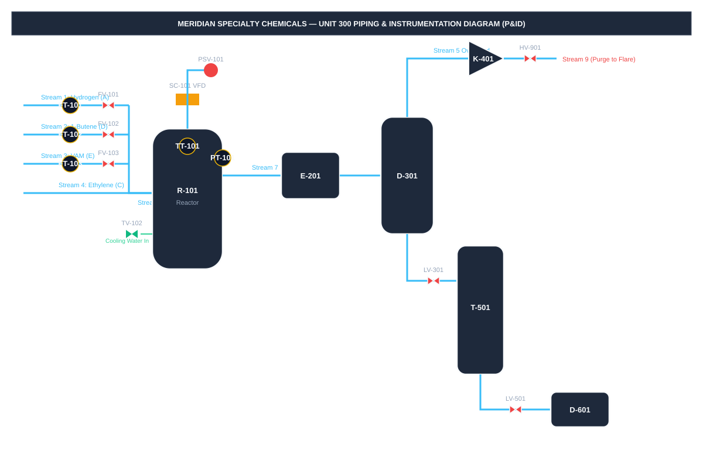

# 1. FACILITY OVERVIEW — BRAZOS BEND WORKS UNIT 300

**Company:** Meridian Specialty Chemicals, Inc. (MSC)  
**Site:** Brazos Bend Works — 480-acre petrochemical complex, Texas Gulf Coast corridor.  
**Unit:** Unit 300 — EVA / Polyolefin Copolymer Plant  
**Nameplate Capacity:** 165,000 MT/year combined G+H resin (20,900 kg/h at 95% on-stream factor).  
**Operating Regime:** 24/7 continuous operation, 4-crew rotating shift pattern.  

### Process Safety & Compliance Profile
- **OSHA PSM Status:** Covered Process under 29 CFR 1910.119 due to flammable hydrocarbon inventory (>10,000 lbs Ethylene, 1-Butene, Hydrogen).
- **PHA/HAZOP Last Revalidated:** 2023-11-14. Next Revalidation Due: 2028-11-14.
- **RMP Level:** EPA Program 3.
- **Alarm Management Standard:** ANSI/ISA-18.2 compliant with rationalized H/HH and L/LL alarms and 30-second anti-chatter debounce.

### Main Unit Equipment Summary
- [R-101 Reactor](../02-equipment/r-101-reactor.md): Primary gas-phase copolymerization reactor.
- [E-201 Condenser](../02-equipment/e-201-condenser.md): Product partial condenser.
- [D-301 Separator](../02-equipment/d-301-separator.md): Vapor-liquid separator flash drum.
- [K-401 Compressor](../02-equipment/k-401-recycle-compressor.md): Gas recycle compressor.
- [T-501 Stripper](../02-equipment/t-501-stripper.md): Steam stripper column.
- [D-601 Surge Drum](../02-equipment/d-601-product-surge-drum.md): Product surge drum ahead of [P-601A/B Pumps](../02-equipment/p-601a-product-pump.md).

### Unit 300 Process & Instrumentation Diagram (P&ID)

