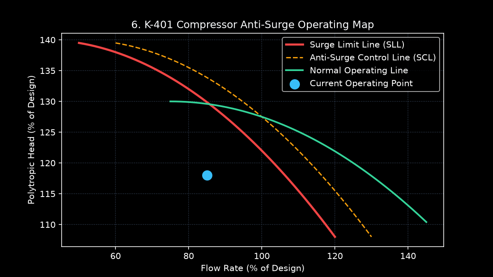

# K-401 — Gas Recycle Compressor (Master Data Sheet)

### 1. Equipment Summary
Recycle Compressor K-401 takes unreacted gas overhead (Stream 5) from Separator D-301, boosts pressure from 2.55 MPag to 2.90 MPag, and returns the gas to the Reactor R-101 feed header (Stream 8), closing the reactor gas loop.

- **Manufacturer:** Elliott Group (Model 2B-35 Centrifugal Compressor)
- **Driver:** 3,200 kW (4,290 HP) 6.6 kV synchronous motor, fixed speed 8,800 RPM via speed-increasing gearbox.
- **Suction / Discharge Pressure:** 2.55 MPag / 2.90 MPag
- **Power Consumption:** Measured by [JT-401 (XMEAS-20)](../03-instrumentation/xmeas-20-compressor-work.md) (Normal: 2,650 kW).
- **Anti-Surge Protection:** Dedicated high-speed anti-surge controller [SIC-401](../05-control-loops/loop-sic-401-antisurge.md) modulating anti-surge recycle valve [HV-401 (XMV-05)](../04-final-control-elements/xmv-05-compressor-recycle-valve.md).
- **Mechanical Relief:** [PSV-401](../06-safety-instrumented-system/psv-401.md) set at 3.50 MPag on discharge manifold.

### K-401 Compressor Anti-Surge Operating Map

