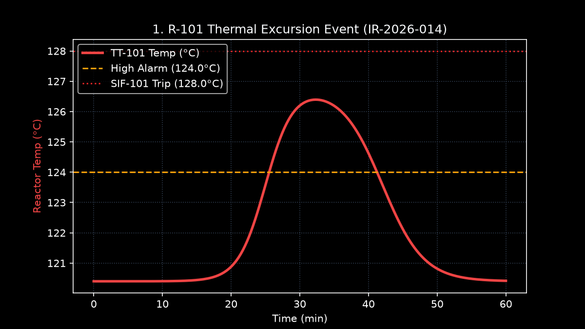

# R-101 — Gas-Phase Copolymerization Reactor (Master Data Sheet)

### 1. Equipment Summary & General Description
Reactor R-101 is the core gas-phase catalytic copolymerization reactor in Unit 300. It produces Ethylene-Vinyl Acetate (EVA) and Ethylene-1-Butene copolymers via continuous Ziegler-Natta catalyst slurry injection. The vessel is a vertical, jacketed pressure vessel featuring an internal helical cooling coil and a variable-speed mechanical agitator.

- **Manufacturer:** Nooter Fabricators, Inc. (Serial No. C-89421)
- **Year Installed:** 1994 (Refurbished 2022 during Major Turnaround TAR-22)
- **Design Volume:** 122.0 m³ (Normal Liquid/Bed Operating Volume: 85.0 m³)
- **Design Pressure / Temperature:** 4.80 MPag (696 psig) / 200.0 °C
- **Normal Operating Pressure:** 2.80 MPag (Monitored by [PT-101](../03-instrumentation/xmeas-07-reactor-pressure.md))
- **Normal Operating Temperature:** 120.4 °C (Monitored by [TT-101](../03-instrumentation/xmeas-09-reactor-temperature.md))
- **Shell Material of Construction:** SA-387 Grade 11 Class 2 Chrome-Moly Steel (Nominal Thickness: 38.0 mm) with 3.0 mm 316L Stainless Steel internal explosion-bonded cladding.
- **Internals Material:** 316L Stainless Steel.

### 2. Mechanical Agitator & Drive Assembly ([SC-101](../04-final-control-elements/xmv-12-reactor-agitator-speed.md))
- **Agitator Type:** Dual-stage anchor and helical ribbon impeller designed for polymer slurry suspension.
- **Motor Driver:** 150 kW (200 HP) Explosion-proof induction motor, 460V, 3-Phase, 60Hz.
- **Speed Control:** Variable Frequency Drive (VFD) controlled via DCS tag SC-101 (Normal speed: 68% of max 120 RPM).
- **Shaft Seal:** Double mechanical liquid-lubricated cartridge seal with pressurized mineral oil barrier fluid system (Seal Oil Pot P-101-SO).

### 3. Thermal Management & Cooling Utility
- **Primary Cooling Jacket:** Split-ring pipe jacket fed by site cooling water via control valve [TV-102 (XMV-10)](../04-final-control-elements/xmv-10-reactor-cooling-water-valve.md). Heat duty: 6.5 MW.
- **Secondary Internal Cooling Coil:** 316L SS 3-inch helical internal coil fed by chilled glycol/water solution. Heat duty: 4.0 MW.
- **Total Heat Removal Capacity:** 10.5 MW at maximum cooling water flow rate (450 m³/h).

### 4. Overpressure Protection & Safety Instrumented Systems
- **Primary Mechanical Relief:** [PSV-101](../06-safety-instrumented-system/psv-101.md) — 8" x 10" Orifice T spring-loaded relief valve set at 4.80 MPag discharging to flare header.
- **Safety Instrumented Functions:**
  - [SIF-101 (High-High Temp Interlock)](../06-safety-instrumented-system/sif-101-reactor-high-temp.md): Trips at 128.0 °C. Closes feed valves FV-101..104 and opens TV-102 to 100%.
  - [SIF-102 (High-High Pressure Interlock)](../06-safety-instrumented-system/sif-102-reactor-high-pressure.md): Trips at 3.35 MPag. Isolate feed streams.
  - [SIF-103 (Loss of Cooling Water)](../06-safety-instrumented-system/sif-103-cooling-water-loss.md): Trips on cooling water supply failure >30s.

### 5. Maintenance, Inspection & Mechanical Integrity Log
- **API 510 Internal Inspection:** Last completed 2024-03-15 by Hartford Steam Boiler Inspection Co.
- **UT Thickness Survey:** Next Inspection Due: 2026-03-15 (**STATUS: OVERDUE**). Shell thickness measured at 34.1 mm (Min allowable: 32.5 mm).
- **Historical Incident IR-2026-014 (2026-01-14):** Reactor temperature rose to 126.8 °C due to positioner binding on cooling water valve [TV-102](../04-final-control-elements/xmv-10-reactor-cooling-water-valve.md) (IDV-14 fault). Operator switched to manual coil cooling override to restore thermal control.

### Operational Temperature & Thermal Excursion Trend

