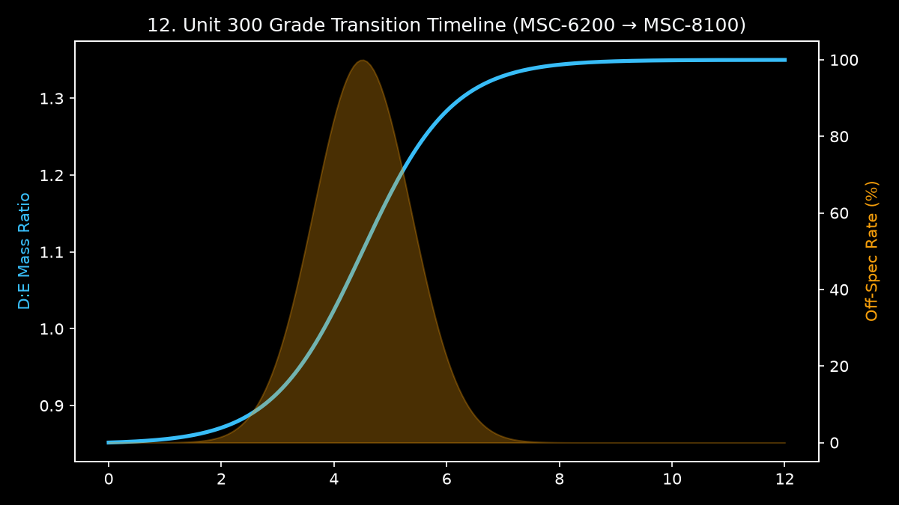

# SOP-300-04 — Product Grade Change Procedure

D:E ratio ramp procedure, transition-material handling, QC hold points (cross-reference [Process Chemistry](../00-overview/process-chemistry.md), [Ratio Controller](../05-control-loops/loop-ratio-de-feed.md)).

### Grade Transition Ramp & Off-Spec Generation Timeline

